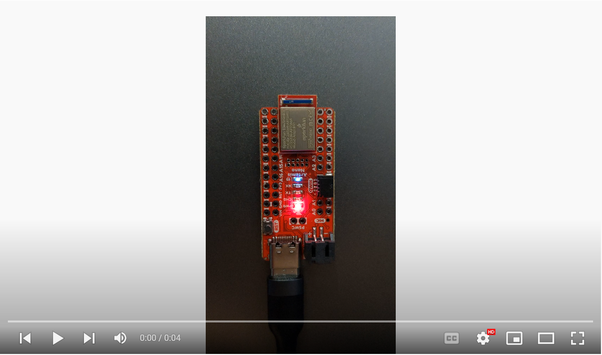
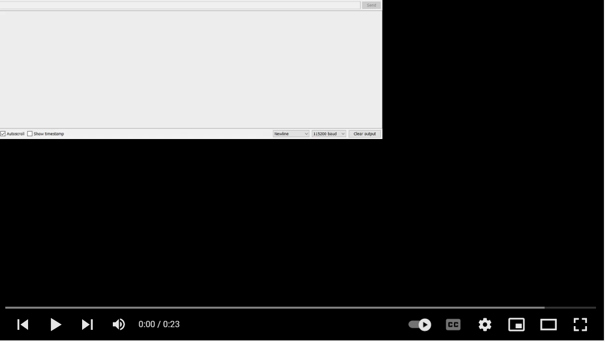
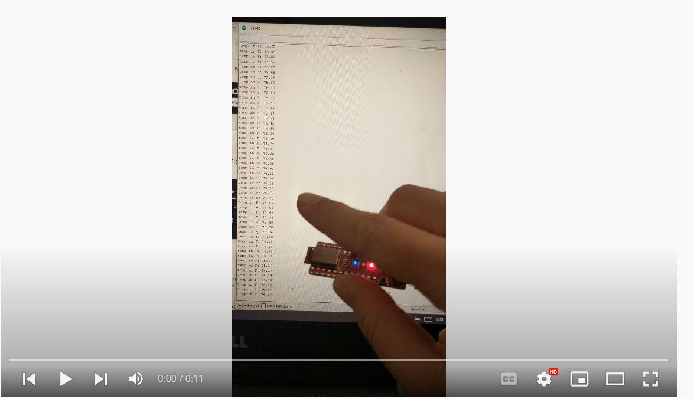
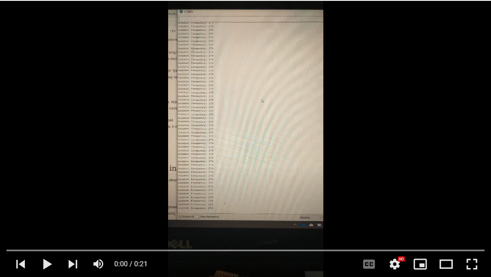

layout: page
title: "Lab 1"
permalink: /ECE4960_FastRobots/lab1/

# Lab 1: Artemis Setup
The objective of this lab is to setup the Artemis test and basic functions using Arduino IDE. The lab consists of 4 poritons: blink the on-board LED, read/write serial messages over USB, display the output from the onboard temperature sensor, and measure the loudest frequency recorded by the Pulse Density Microphone.

## Blink it Up
Upon first try of running the example code, I got gibberish out of the serial terminal. Upon closer look, I needed to adjust the baud rate. I set the data rate to 11520 baud.  

## Serial
In this exercise, I uploaded and played with the Serial example in the example library. The sample code implemented an "echo" in the serial monitor. This can be seen in the video: everything inputted into the serial monitor is spit out in the output. 

## analogRead
I modified the analogRead example code slightly for this portion of the lab. The original code printed the raw temperature and the voltage. I printed the output of `getTempDegF()`, a function that computes the temperature in Fahrenheit.

## MicrophoneOutput
In this exercise, I demonstrated a few different frequencies of whistle. Each time, the Serial monitor reflected the highest frequency at the moment.  

