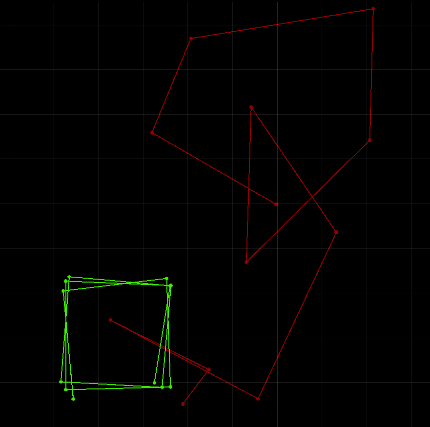

layout: page
title: "Lab 10"
permalink: /ECE4960_FastRobots/lab10/

# Lab 10: Simulator

In this lab, I familiarize myself with the simulator and the associated code base by performing open and close loop control on the simulated robot.

## Open Loop Loop
The objective of this exercise is to make the robot drive in a square loop using open loop control. My strategy is to iteratively figure out appropriate speed and time values that make a robot drive a reasonable distance and turn approximately 90 degrees. I used the `set_vel()` function in the `Commander` class and the `sleep()` function in the Python `time` module to accomplish this. After a few tries, I determined that the following values worked well. Note that the linear speed unit is m/s, the rotational speed unit is rad/s, and the time unit is s. 

```
cmdr.set_vel(0.5,0) # drive at 0.5m/s
time.sleep(1) # for 1 second
cmdr.set_vel(0,3) # turn left at 3 rad/s
time.sleep(0, 0.51) # for 1.02 seconds
```
To avoid blocking other operations while moving using `sleep()`, so I implemented the moving in an asynchronous function.

```
async def driveAndPlot(speed, time):
    cmdr.set_vel(speed,0)
    await asyncio.sleep(time)
    
    pose, gt_pose = cmdr.get_pose()
    cmdr.plot_odom(pose[0], pose[1])
    cmdr.plot_gt(gt_pose[0], gt_pose[1])

async def turn(speed, time):
    cmdr.set_vel(0,speed)
    await asyncio.sleep(time)
```
I chose to only plot in the function that causes translational motion since the plotter does not differentiate between orientations. I called the functions in a loop that asked the robot to loop a square 3 times (12 turns). 

while cmdr.sim_is_running() and cmdr.plotter_is_running() and turnCount < 12:
    await driveAndPlot(1,0.5)
    awat turn(1.5, 1.05)
    
    turnCount = turnCount + 1;

Notice that I doubled the translational speed but halved the duration. I also tried to halve the rotational speed and double the duration. However, I found that the robot required more time to turn approximately 90 degrees. While I am unsure why this happened, my guess is that there is some sort of lagging or inaccuracies happening as I speed up the turning speed that causes the robot to behave a bit differently or more inconsistently. 

We can see in the plot that, even at a lower speed, the robot still does not drive super consistently in open loop control by time. The squares do not trace out the exact same shape, but they are pretty close.



Below is a video of the robot's driving that generated the plot
<a href="http://www.youtube.com/watch?feature=player_embedded&v=IOvc6t3UyQE" target="_blank"></a>

## Close Loop Object Avoidance
For this task, I will use the TOF distance sensor to help the robot avoid the wall. To begin, I figured out an appropriate distance from the wall at which the robot should turn in order to not hit the wall. The logic of my code initially consisted of simply checking distance to the wall, and turning when the wall is deemed too close. I also made sure to decrease the duration of `sleep()` in order to make sure that the sensor was reading as current of data as possible. This task required playing with many differnt variables through trial and error, so I decided to write a list of variables that made tuning easier. These are my final values used, 

```
distThreshold = 0.6
driveSpeed = 1
turnSpeed = 3
turnPeriod = 0.17
```

Similar to [Robby's observations](https://lh479.github.io/ECE4960/) I noticed that sometimes the robot would run into an abstacle that it does not see, since the width of the robot extends outside the width of the sensor reading. Hence, I tried making the robot waggle dance as it drove forward: the robot drives in more of a zigzag than a straight line in order to sweep a larger area with the distance sensor while driving. This is accomplished by simply toggling back and forth the turning direction while I gave the robot a translational speed and some turning speed. By keeping my turning period low, I was able to drive fast with little turning. 

In addition, I tried to make the robot drive quickly (partially due to my own impatience) during the task. This resulted in the robot being unable to turn in time, especially since the distance to the wall is read to be greater when the robot turned (as opposed to face directly at it). Hence, I made the robot backup while turning to avoid the wall.

```
while cmdr.sim_is_running() and cmdr.plotter_is_running() and turnCount < 10:
        
    cmdr.set_vel(driveSpeed, turnDir * turnSpeed)
    await asyncio.sleep(turnPeriod)
    
    pose, gt_pose = cmdr.get_pose()
    cmdr.plot_odom(pose[0], pose[1])
    cmdr.plot_gt(gt_pose[0], gt_pose[1])
    
    turnDir = -1*turnDir
    
    sensor_val =  cmdr.get_sensor()
    
    if sensor_val < distThreshold: 
        cmdr.set_vel(-driveSpeed/4, turnSpeed)   
        await asyncio.sleep(0.51)
        turnCount += 1
```

Note that the strategies that I used to make the simulation work may not be beneficial to implement on a real robot. For example, the rapid waggle back and forth will means extra turning likely introduce more error to gyroscope reading of the orientation. Moreover, backing up quickly away from the wall will inevitably lead to skidding that throw off the prediction step in Bayes' filter localization that relies on control-state change consistencies. 

Here is a demo of the close loop object avoidance

<a href="http://www.youtube.com/watch?feature=player_embedded&v=_kVfG0nS_Yw" target="_blank"></a>

