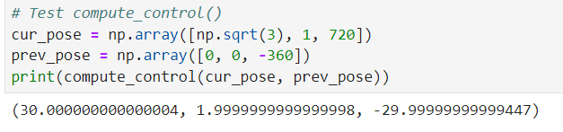
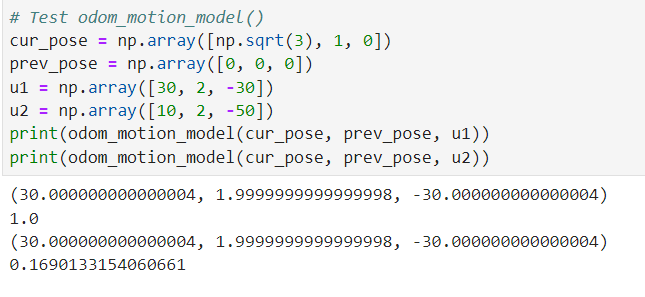
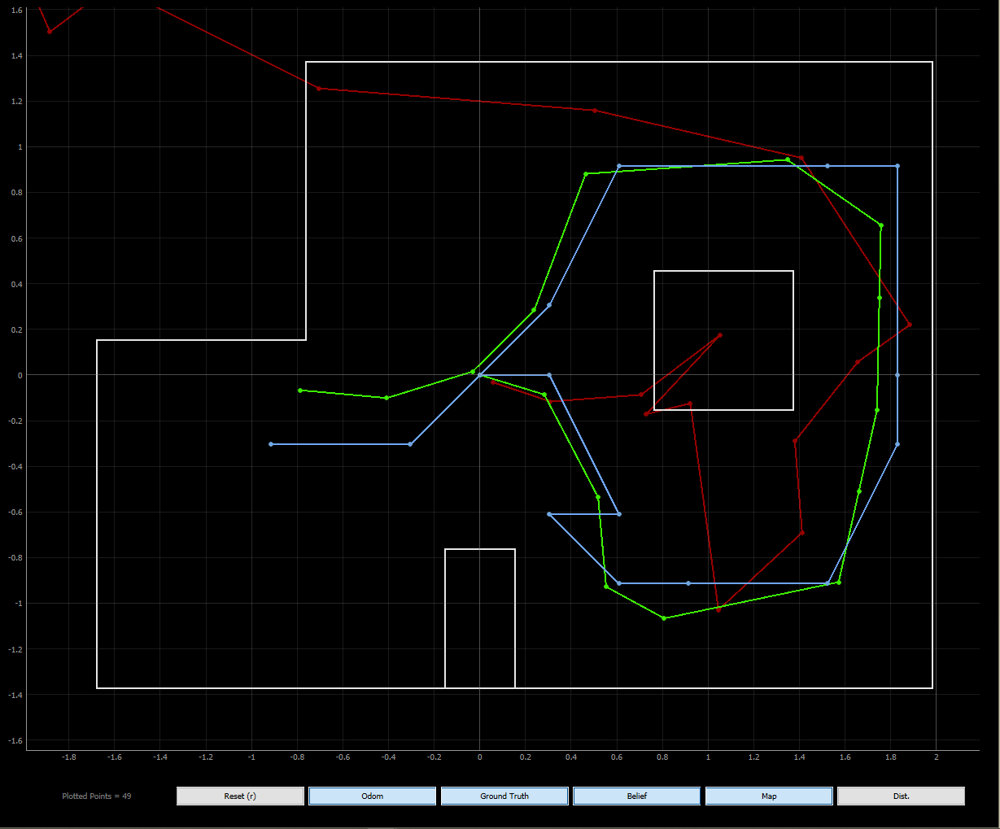
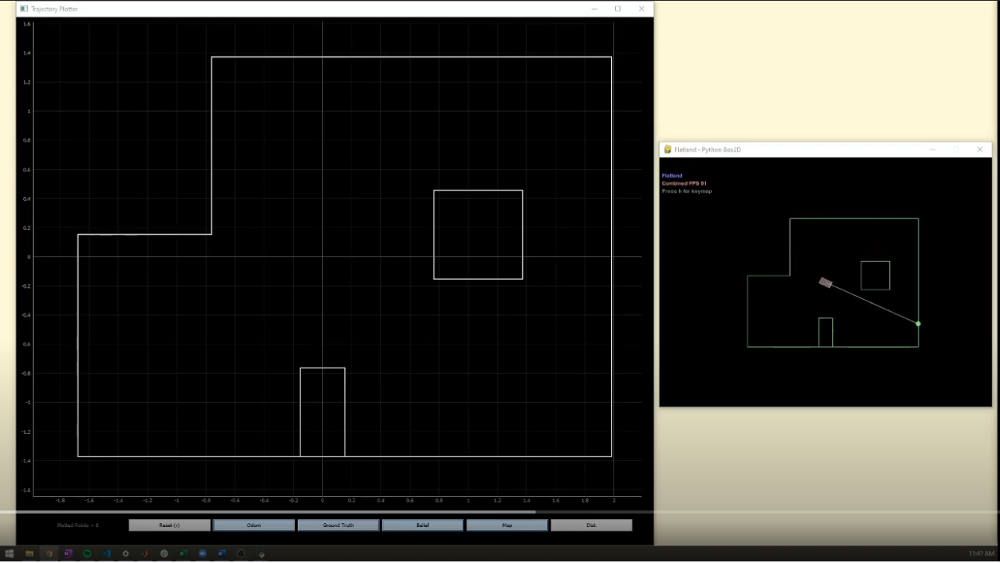

layout: page
title: "Lab 11"
permalink: /ECE4960_FastRobots/lab11/

# Lab 11 - Grid Localization using Bayes Filter
In this lab, I implemented grid localization using Bayes Filter. The filter was implemented in Python to be compatible with a robot simulator. I utilized the Base Localization and Mapper classes provided in the code base to accomplish this task. 

## Dynamics Model
This Bayes filter uses an odometry model to perform state estimation. The change between two states is described by a sequence of rotation. translation, and rotation. To help my filter model the state change, I wrote a function that computes the rotation, translation, and rotation that occurred given a start and end state. To make sure that the sequence of control is unique, I made sure to use the `normalize_angle()` function in the Mapper class to convert angles into be in the interval of [-180, 180).

```
def compute_control(cur_pose, prev_pose):
    
    delta_trans = np.sqrt((cur_pose[0] - prev_pose[0])**2 + (cur_pose[1] - prev_pose[1])**2)
    
    delta_rot_1 = np.arctan2(cur_pose[1] - prev_pose[1], cur_pose[0] - prev_pose[0]) - normalize_angle(prev_pose[2])
    delta_rot_2 = normalize_angle(cur_pose[2] - prev_pose[2] - delta_rot_1)
                          
    return np.degrees(delta_rot_1), delta_trans, np.degrees(delta_rot_2)
```

Next, I used the `compute_control()` function in a function that estimated the probability of a state change given a start and end state. This function will later be used to calculate the probabilities of every state on the map to generate a probability distribution of the robot's location on the map.

```
def odom_motion_model(cur_pose, prev_pose, u):
    
    actual_u = compute_control(cur_pose, prev_pose)
    
    prob = loc.gaussian(normalize_angle(u[0]-actual_u[0]), 0, loc.odom_rot_sigma) * \
           loc.gaussian(normalize_angle(u[1]-actual_u[1]), 0, loc.odom_trans_sigma) * \
           loc.gaussian(normalize_angle(u[2]-actual_u[2]), 0, loc.odom_rot_sigma)

    return prob
```
After completing the dynamics model, I wrote tests for the functions before proceeding. This helped me make sure that the outputs of the functions are as I expect. 



The test for the `compute_control()` function showed that it correctly calculated the control required to traverse a 30-60-90 triangle. I also fed in angles outside of the [-180, 180) range to test that my funciton correctly normalized the angles. 



I fed in 2 different controls to test the `odom_motion_model()` function. As expected, the control for the 30-60-90 triangle yielded a high probability while the other control yielded a lower one. 

## Filter
Once I have established the dynamics model, I am ready to use it in my Baye's filter prediction step. The prediction step consists of iterating through every pair of grids in the map and determining the probability that the robot traversed between the two grids given some control during that time step. I accomlished this by nesting 6 for loops that iterates through the 3 dimensions of my occupancy grid.

```
def prediction_step(cur_odom, prev_odom):

    for i in range(mapper.MAX_CELLS_X):    
        for j in range(mapper.MAX_CELLS_Y):
            for k in range(mapper.MAX_CELLS_A):
                if loc.bel[i][j][k] < 0.0001: # skip this cell if low probability
                    continue
                loc.bel_bar[i][j][k] = 0
                for a in range(mapper.MAX_CELLS_X):    
                    for b in range(mapper.MAX_CELLS_Y):
                        for c in range(mapper.MAX_CELLS_A):
                            loc.bel_bar[i][j][k] +=  odom_motion_model(mapper.from_map(i, j, k), mapper.from_map(a, b, c), u) * loc.bel[i][j][k]

    loc.bel_bar = loc.bel_bar / np.sum(loc.bel_bar) # normalize belief
```

To reduce the time required to do the prediction step, I skipped each cell that has a low (< 0.0001) prior belief. For each grid, I accumulated the probability over the possible changes in state based on my odometry model. At the end of the prediction step, I normalize the total probability to 1.

After executing the prediction step, I used the sensor data to complete the update step. The sensor model of the robot consists of rotating in the cell and collecting 18 distance readings spaced equally across the full revolution. We update the belief in each state by taking the product of the probabilities across the 18 sensor readings for each state.

```
def update_step():

    for i in range(mapper.MAX_CELLS_X):    
        for j in range(mapper.MAX_CELLS_Y):
            for k in range(mapper.MAX_CELLS_A):
                loc.bel[i][j][k] = 1
                for m in range(mapper.OBS_PER_CELL):
                    loc.bel[i][j][k] *= loc.gaussian(loc.obs_range_data[m] - mapper.obs_views[i][j][k][m], 0, loc.sensor_sigma)

    loc.bel = loc.bel / np.sum(loc.bel) # normalize belief
```

Similar to the prediction step, I normalize the total probability to 1 at the end of the update step. I incorporated the sensor model into my update step by calling the `gaussian()` function directly for each comparison of the precached observation and the sensor reading at that time step. 

## Simulation 
Finally, we are ready to run the simulation. As we can see, the Baye's filter belief closely follows the ground truth in the plot. As expected, the resulti of the belief is limited by our occupancy grid model. We can get a better estimate if we increase the number of cells. However, this is a design choice tradeoff between computation time and accuracy. 



I noticed that the Baye's filter belief is less precise when the robot's state has many possible cells to/from which it could traverse to (for instance, in open spaces). Moreover, our odometry model is not as good at predicting orientation. This can be explained by our high covariance in orientation `odom_rot_sigma = 15` compared to a relatively low covariance in translation `odom_trans_sigma = 0.45`. Finally, the belief is more correct when the robot is in a location where the surrounding features yield more unique distance readings (e.g. next to obstacles rather than just walls) as this gives information that helps the sensor model throw out improbable states. 

<a href="http://www.youtube.com/watch?feature=player_embedded&v=-WXcqlH8ZpA" target="_blank"></a>

Simulation run that generated the localization plot.