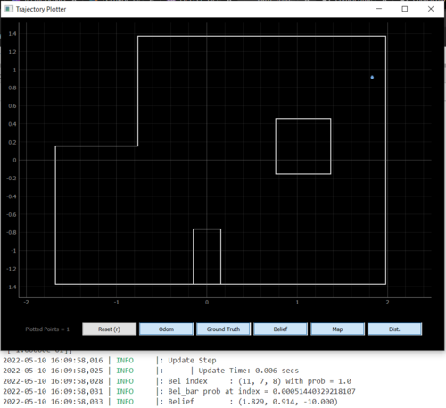

layout: page
title: "Lab 12"
permalink: /ECE4960_FastRobots/lab12/

# Lab 12: Localization - Real
In this lab, I implemented localization on the real robot. This task called for reusing the mapping command from Lab 9 and a Bayes Filter implementation. 

## Simulation
Before we try to do this on the real robot, let's try out the Baye's Filter localization in simulation. The robot traversed a pre-set trajectory and performed an observation loop at each step: read the distances in 18 intervals while turning 360 degrees. The result is shown in the following plot, with green representing the ground truth, blue representing the Baye's Filter belief, and red representing dead reckoning from odometry.


As we saw in my implementation in Lab 11, the Bayes Filter struggles a bit in the rightmost portion of the map. However, this solution implementation is able to correct the belief at the end. 

## Real

My implementation onto the real robot consists of a few parts. First, a function that calls the mapping command and waits for the results:
```
async def perform_observation_loop(self, rot_vel=120):
        
        .
        .
        .
        self.ble.send_command(CMD.COLLECT_MAP, "18|3|0|2|1")

        while self.bearingsCount < 18:
            if self.bleStringChar == "stop":
                break             
                
            await asyncio.sleep(0.01)

        self.sensor_ranges[1:] = np.flip(self.sensor_ranges[1:])
        self.sensor_bearings[1:] = np.flip(self.sensor_bearings[1:])
        
        return self.sensor_ranges, self.sensor_bearings

```

Notice that I had to use `numpy.flip()` on my ranges and bearings arrays, as my robot actually performs the 360 sweep in the clockwise direction. The outputs that the `asyncio.sleep()` is waiting for is collected from the robot by a notification handler and a data processing function
```
def bleStringChar_notifHandler(self, uuid, bleStringChar_byteArr):
        self.bleStringChar = self.ble.bytearray_to_string(bleStringChar_byteArr)
        self.dataLog += "\n" + self.bleStringChar
        self.extractRangeAndBearing()
        
    def extractRangeAndBearing(self):
        data = self.bleStringChar.split(",", 5)
        .
        .
        .
        if self.bearingsCount < 18 and distFront > 0:
            self.sensor_ranges[self.bearingsCount] = distFront/1000
            self.sensor_bearings[self.bearingsCount] = -float(data[1])
            
            self.bearingsCount = self.bearingsCount + 1
```

After this initial implementation, my localization was doing okay in terms of (x, y) coordinates but was doing horrendously in terms of orientation. Not only was it predicting angles that are way off (any where from 50 to 180 degrees), it was inconsistent too. After plotting some of my mapping data, it was apparent that my robot's distance readings start off okay but end pretty gibberish.

At the time, my Arduino implementation was having my robot turn as many times as my data log array could handle (the number that I fed in the command helped the robot determine the increment at which it should turn). Oftentimes, my robot is turning 20 or so times. Per Vivek's suggestion, I decided to rewrite some of the Arduino code to better figure out what my robot is doing versus what I _think_ it is doing. After my robot stop after it has collected all of its 18 data points, I realized that my robot was way over-turning. That is, the gyroscope drifting effect was much worse than I had observed in my IMU characterization. To be specific, it was approximately 40 or so degrees off by the ened of its 360. Hence, I approximated the drift to be something that increased linearly with each little turn that my robot did, and corrected for that by subtracting it from the set point that I asked for the PID controller to hit.

```
setPoint = setPoint + angleIncrement - numData*stepDrift
```

After this correction and trying the run in the dark (blinds closed, lights off; tip courtesy of Robby), my robot was able to localize to the correct angle as well as position. 

<p float="left">
  
  
  
  
</p>

Overall, I deemed the filter to be successful at localizing if it predicted the position correct within 1 cell and +/- 10 degrees. Since the grid cells for angles were intialized as 0:20:360, I am never going to get 0 degrees dead-on. Note how the real localization also guessed one cell east, when toward the righthand side of the map, just like the simulation. My guess is that the update step does not do well when the ratio of the convex to concave corner ratio is high.

Here is a video of my robot performing localization at (-3, -2)

<a href="http://www.youtube.com/watch?feature=player_embedded&v=Lrvyxq8TZBk" target="_blank"></a>


