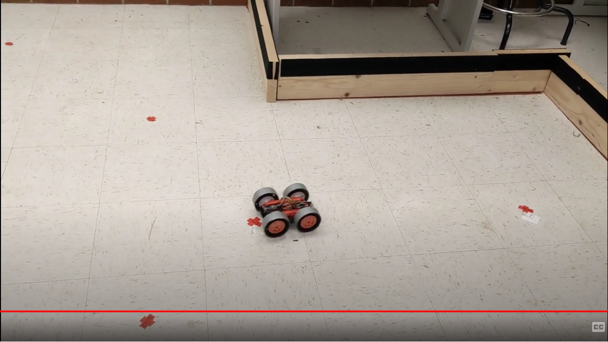

layout: page
title: "Lab 13"
permalink: /ECE4960_FastRobots/lab13/

# Lab 13 - Path Planning and Execution
For this lab, I will be traversing a preset list of waypoints around the map. My plan was to first attempt to go around the map using a precomputed sequence of turns and straights, executed by PID angular and wall distance control. Then if that is not reliable, I can then try to localize. 

Here are a few reasons why I did not include localization in my initial plan. At best, my localization is as good as the grid cell resolution and will not be able to accurate locate my robot if it is not at the center of a grid. In addition, I know that localization will also change the location of my robot. As by robot does its observation revolution, the robot does not stay perfectly in place. I do not want to risk localization being the action that throws my robot off course. 

Before I began writing code for my Artemis, I took advantage of the Localization class's `compute_control()` to find the sequence of turns and straights I need the robot to take to navigate the path. Since the waypoints provided do not contain orienation information, I decided to have my robot will stay aligned with the path that it took to get to the current waypoint. Effectively, I chose the control sequence to be executed as a turn then a drive straight too the next way point. I made this decision so that the turn can occur at an earlier time and be less affected by drift. 

```
waypoints = np.array([[-4, -2, 1, 2, 5, 5, 5, 0, 0],
                            [-3, -1, -1, -3, -3, -2, 3, 3, 0], 
                            [90, 90, 0, -90, 0, 90, 90, 180, -90]]) * 0.3048
        
waypoints[2,:] = np.array([45, 45, 0, -63.43, 0, 90, 90, 180, -90])
```

Similarly, I wanted to precompute the views of the robot at these waypoints and orientations so I can control the distance of robot from the next wall. In order to do that, I wrote a helper function for the Mapper class

```
def get_waypoint_views(self, waypoints, bearings):
        views = np.zeros((9,4))
        hits = np.zeros((9,4,2))

        for i in range(9):
            tracing_ray = self.get_tracing_rays(waypoints[0,i], waypoints[1,i], bearings[:,i])

            # For each tracing ray, find the point of intersection and range
            for j in range(4):
                try:
                    views[i,j], hits[i,j,:] = self.get_intersection(tracing_ray[:,:,j], waypoints[:,i])
                    print(views[i,j], hits[i,j,:])
                except:
                    print("except? ")
                    print(i)
                    print('\n')
                    return views, hits
                    pass

        return views, hits
```

This function is based on `populate_views()`, but it only returns the views of the 0, 90, 180, and 270 degree views of the robot from its center. The reason why I precached a few extra views was to protect for being able to drive in a different orientation and use my side TOF sensor. After finding these vales, I needed to subtract 70mm or 35mm from each of the predicted views to account of where the first and side TOF sensors are placed. 

For this lab, I knew that driving slow would help me with repeatbility and also sensor readings. Hence, I drive as slow as possible (PWM < 60) and made sure to wait for my TOF sensor to range each time in my distance reading function

```
void readErrorToWall()
{
    while(!tof1.checkForDataReady()){ delay(1);}

    int dist = tof1.getDistance();
    tof1.clearInterrupt();
    tof1.startRanging();
    currentDistError = dist - setPoint;
    
    distToWall[dataCount] = dist;
}
```

If `currentDistError` is close enough to a (tunable) threshold of the expected distance, the robot moves on to the next control sequence. I reused my PID controller from turning for distance. The only changes that I need to make are how my control output is which motor controller inputs to send a corresponding PWM signal to for the robot to drive forward/backward instead of turn. I also made sure to tune the deadbad and maximum values of the turning and driving PID separately, as it requires higher power to turn in place. 

After this initial implementation, I realized that the first --> second waypoint is difficult for the robot to execute as the TOF is pointed at a faraway wall and the wall is also not perpendicular to the sensor. Hence, I decided to change up the waypoints that my robot tries to traverse. 


In this new trajectory, the robot is also pointing at a perpendicular wall. I also made the robot drive backwards as it made from waypoint 2 to waypoint 3 (i.e., it is pointing in the -x direction), so it can read the slightly closer wall. This modification called for recomputing the controls and expected views using the method from before. After making this modification, my robot's performance ewas much more consistent.

Finally, I made some manual adjustments to the expected distances to account for for speed and sliding (I still had my wheels duct tape). The final result is shown in the video.

<a href="http://www.youtube.com/watch?feature=player_embedded&v=PN6yv-wLLKc" target="_blank"></a>

Since the robot follows the desired trajectory well within 1 grid cell, I decided it is not necessary to add in localization. Note that the robot drives through/past waypoints 6 and 9 by a bit because I did not go back and adjust for sliding (since passing through the waypoints is good enough for the purpose of this lab).