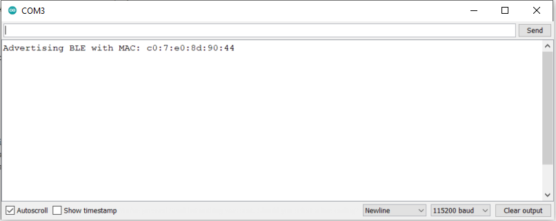
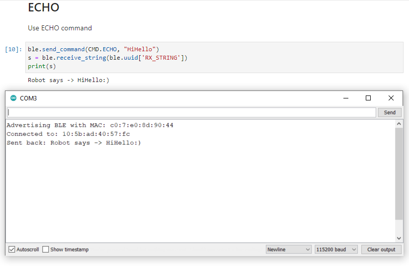

layout: page
title: "Lab 2"
permalink: /ECE4960_FastRobots/lab2/

[Back to home](https://jojoliangs.github.io/ECE4960_FastRobots/ "ECE 4960 - Jojo Liang - Home")

# Lab 2: Bluetooth Communication
In this lab, I setup and tested bluetooth communication between my compuer and the Artemis board. I also implemented a few 

## Demo 
I began by running the demo code to ensure that my bluetooth functionalities were working as expected. Initially, I had trouble connecting to the computer to the Artemis board using the MAC address shown in the Arduino Serial Monitor when the Artemis board began advertising. 

The issue was promptly resolved after I left pad the second pair of hexidecimal with a 0. Curiously, the connection presented an error on the first try and resolved itself. I was not able to replicate the error after this. 

## _ECHO_
In this exercise, I wrote the _ECHO_ command. The command sends a string value from the computer to the robot. Then, the Artemis board augments the string with "Robot says -> ... :)". Finally, the Artemis board sends the message with the prefix and postfix back to the computer. 

## *SEND_THREE_FLOATS*
I wrote the *SEND_THREE_FLOATS* command by following the structure of the provided sample code for *SEND_THREE_FLOATS*. I made sure to change the data type from *int* to *float* and made 3 calls of `robot_cmd.get_next_value()` to extract all 3 float values from the command.

## BLEFloatCharacteristic Notification Handler
I wrote a notification handler function to update the _float_ characteristic every time the characteristic value changes. This allows the computer to have the updated value without having to explictly calling a `read()` function. 

## Receiving float values using `receive_float()` vs. `receive_string()` 
Using `receive_float()` allows the computer to receive a value that can be used directly in computation while using `receive_string()` would require the computer to convert the *string* to the corresponding *float* value before use. However, `receive_string()` would allow the robot to send multiple *float* values encoded into one *string*, which would save time if the robot needs to send many values in a short interval of time (which can be the case when implementing sensor fusion). 