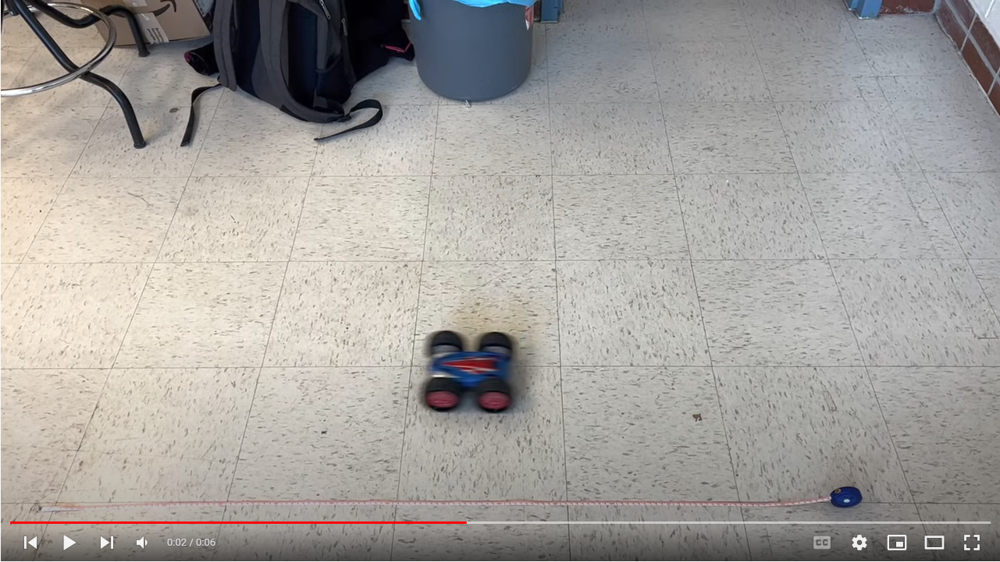
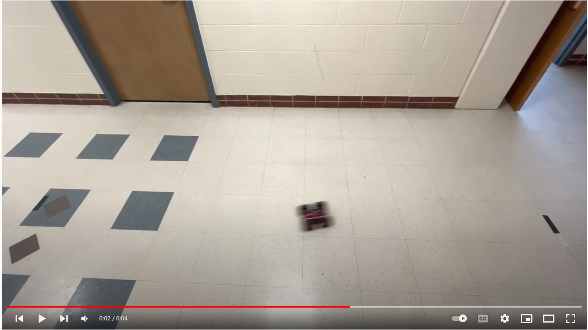
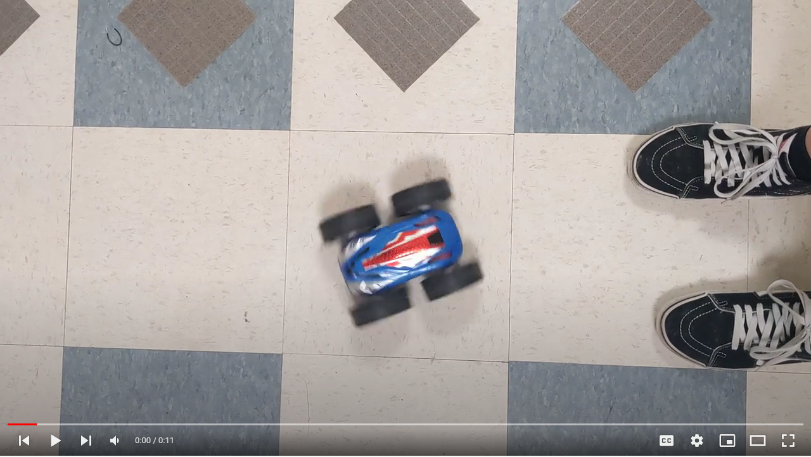
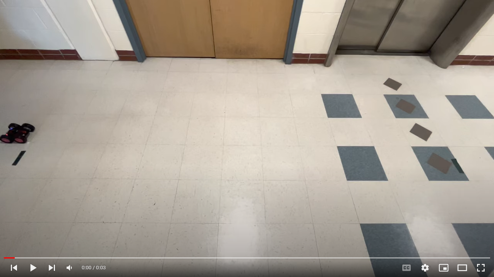

layout: page
title: "Lab 4"
permalink: /ECE4960_FastRobots/lab4/

# Lab 4: Robot Characterization

## Qualitative characteristics
THere were some qualities that were not measured but observed. Some of these inform the quantities to measure
* The car flips when braking on the 800mAH battery, but does not when on the 650mAh one
* During high acceleration/deceleration, some wheels may leave the gorund which leads to control complexity
* The vehicle is symmetric (externally) left to right and top to bottom.
* The car turns drastically even when controllde to be straight

## Stationary characteristics
Before driving, I took the following measurements of the vehicle

* Overall dimensions: 7.15" 5.75" x 3.2" (L x W x H))
* Wheel diameter: 3.2"
* Weight: 500g
* Center of mass: 0.825" forward from the geometric center

I wanted to determine where the center of mass of the car is. This will help me decide acceleration/ deceleration rates that prevent the car from flipping.

## Dynamic characteristics
I did a few tests to test the dynamics of the car. I performed the tests and analysis with Minjung to compare the performance between cars. The data comes from [calculating](https://docs.google.com/spreadsheets/d/1idWWSh0xEPE-ISRhdxRxrnuk90jsQ51Zb4AoevzzLYQ/edit?usp=sharing) the time the car takes to traverse known distances in video. 

| Parameter               | Units      |Jojo's Values  | Minjung's Values  | 
|-------------------------|------------|--------------:|------------------:|
| Braking distance        | m          | 1.01          | 1.42              | 
| Max rotational speed    | rev/s      | 4.71          | 4                 | 
| Max translational speed | m/s        | 4.02          | 3.59              | 
| Max deceleration        | m/s^2      | 8.09          | ----              |
| Max acceleration        | 5m/s^2     | 1.01          | ----              |

Videos of testing 

