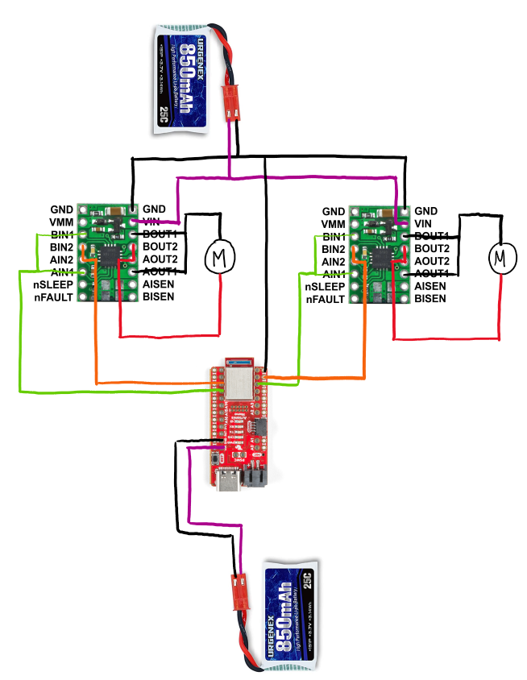
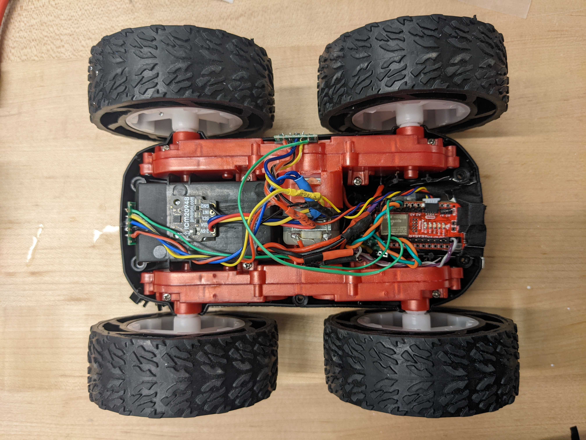

layout: page
title: "Lab 5"
permalink: /ECE4960_FastRobots/lab5/

# Lab 5: Motor Controller

## Prelab

* I used digital pins 6, 7, 11, and 12 for control because those pins support PWM output.
* We use a separate battery to power the motors in order to give the maximum current to the motors and achieve the "fast" in fast robots. In addition, we connect the pins of one dual motor driver together such that one motor driver can supply double the current to each motor.



## Lab
I used a fixed 5V, 3A channel on a power supply. This corresponds with the supply voltage range and parallel output currents indicated in the Motor Driver datasheet 

I first made sure that the motor runs forwards and backwards on a power supply.

```
// lab 5 task 1 drive robot at top speed back and forth for 1s duration each
void digitalDriveTest()
{
  digitalWrite(LEFT1,HIGH); 
  digitalWrite(LEFT2,LOW);
  
  delay(1000);
  
  digitalWrite(LEFT1,LOW); 
  digitalWrite(LEFT2,LOW);
  
  delay(1000);

  digitalWrite(LEFT1,LOW); 
  digitalWrite(LEFT2,HIGH);

  delay(1000);
  
  digitalWrite(LEFT1,LOW); 
  digitalWrite(LEFT2,LOW);

  delay(1000);
}
```

<a href="http://www.youtube.com/watch?feature=player_embedded&v=pPcL4SNI7co" target="_blank"></a>

I used `analogWrite()` to output variable speed on the motor. 
```
// lab 5 task 2
void runRampTest(int forwardVal)
{
  if(forwardVal < 180)
  {
    pwmForwardRampTest();
    Serial.print("forward: ");
    Serial.println(forwardVal);
  }
  else if(backwardVal < 180) 
  {
    pwmBackwardRampTest();
    Serial.print("backward: ");
    Serial.println(backwardVal);
  }
  else
  {
    forwardVal = 0;
    backwardVal = 0;
  }
}

// lab 5 task 2
void pwmForwardRampTest()
{
  analogWrite(LEFT2, 0);
  analogWrite(RIGHT2, 0);
  
  analogWrite(LEFT1, forwardVal);
  analogWrite(RIGHT1, forwardVal);

  forwardVal = forwardVal++;
  
  delay(100);
  
}

// lab 5 task 2
void pwmBackwardRampTest()
{
  analogWrite(LEFT1, 0);
  analogWrite(RIGHT1, 0);
  
  analogWrite(LEFT2, backwardVal);
  analogWrite(RIGHT2, backwardVal);
  
  backwardVal = backwardVal++;
  delay(100);  
}
```

Part way through the process, my motor driver stopped working. I spent a while troubleshooting my code, but found out a long time later that it was a hardware problem. Soldering up a new motor controller fixed the problem.

<a href="http://www.youtube.com/watch?feature=player_embedded&v=pPcL4SNI7co" target="_blank"></a>

Then I verified that the motor worked on battery power
<a href="http://www.youtube.com/watch?feature=player_embedded&v=pPcL4SNI7co" target="_blank"></a>

Implementing two drivers did not give me much trouble. However, I did find that when I used different power supplies, the robot behaved oddly. This issue was not apparent on another power supply nor on battery power, so I moved forward without root causing the issue. In hindsight, I had failed to connect all the grounds in my circuit. 

<a href="http://www.youtube.com/watch?feature=player_embedded&v=pPcL4SNI7co" target="_blank"></a>

I installed everything into my vehicle with a combination of gorilla nad duct tape. I made sure my IMU was as far as possible from my motors as my wires allowed, as to reduce the effect of EMI on my IMU. I made sure that my Artemis USB-C port and TOF sensors had access to the perimeter of the car, in case I ever decide to replace the blue cap. I tucked my motor drivers away underneath the Artemis, for easy access to the headers that I soldered.



I underestimated how fast the robot is the first time around, so my robot did run away from me

<a href="http://www.youtube.com/watch?feature=player_embedded&v=pPcL4SNI7co" target="_blank"></a>

By using my ramp function, I found that the lower limit for motor turning while on the ground is PWM = 49. 

<a href="http://www.youtube.com/watch?feature=player_embedded&v=pPcL4SNI7co" target="_blank"></a>

Despite the motors appearing to start up at the same rate, my car does not drive very straight upon first try. I applied an adjustment factor of 0.92 to my right motor to help my robot drive straighter.

<a href="http://www.youtube.com/watch?feature=player_embedded&v=pPcL4SNI7co" target="_blank"></a>

Finally, I made my robot drive the sequence of straight, turn left, straight, turn right.

<a href="http://www.youtube.com/watch?feature=player_embedded&v=pPcL4SNI7co" target="_blank"></a>