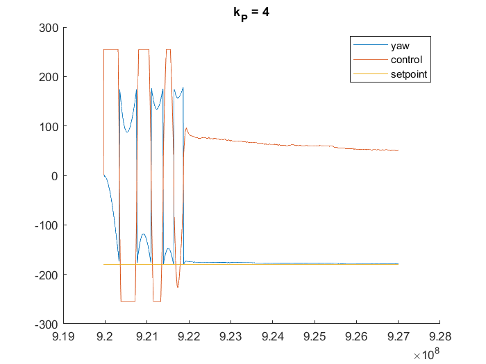
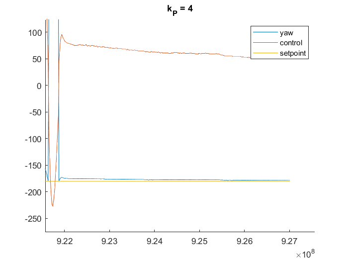
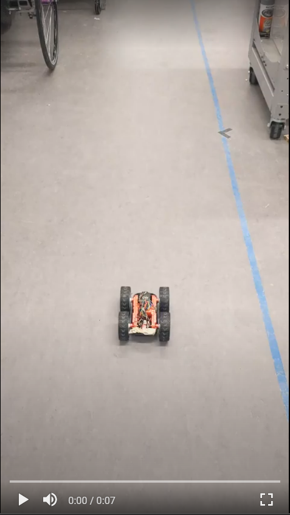

layout: page
title: "Lab 6"
permalink: /ECE4960_FastRobots/lab6/

# Lab 6: Closed-loop control

## Sending Commands and Receiving Data
To make debugging easier, I implemented a new command `INIT_PID` and a string characteristic notification handler. I will later use this to tell the robot to begin PID and to send data from the robot to my computer via BLE at the end of each run. When `INIT_PID` is called, it sets the robot's PID gains, resets some data collection variables, and the robot begins its routine. This allows me to avoid re-compiling the Arduino code during my tuning process. It is worthy to note that I initially made a few extra commands, but later decided to consolidate them so I can execute with a single command and have more compact code. When my pre-alloted data arrays fill up, the robot automatically stops and changes string characteristics. On the computer end, my notification handler appends the data to one large string and print out the data log once the robot indicates that it has sent all the data.

```
def bleStringChar_notifHandler(uuid, bleStringChar_byteArr):
    global bleStringChar
    global dataLog
    bleStringChar = ble.bytearray_to_string(bleStringChar_byteArr)
    dataLog += "\n" + bleStringChar
    
ble.start_notify(ble.uuid['RX_STRING'], bleStringChar_notifHandler)

import asyncio
while True:
    if(bleStringChar == "stop"):
        break
    await asyncio.sleep(1)

print(dataLog)
```
I formatted my data in a way that MATLAB's `readmatrix()` understands. This small decision became very useful when I was tuning, because it took just a few seconds for me to visualize the plots.

```
void formatDataLog()
{    
    tx_estring_value.clear();
    tx_estring_value.append("time, yaw, control, error");
    tx_characteristic_string.writeValue(tx_estring_value.c_str());

    for(int i = 0; i < dataCount; i++)
    {
        tx_estring_value.clear();
        tx_estring_value.append(timestamp[i]);
        tx_estring_value.append(", ");
        tx_estring_value.append(yaw[i]);
        tx_estring_value.append(", ");
        tx_estring_value.append(control[i]);
        tx_estring_value.append(", ");
        tx_estring_value.append(state_error[i]);

        tx_characteristic_string.writeValue(tx_estring_value.c_str());
    }
}
```

## Controller 
I tested my PID control by spinning the robot in plalce first. Upon initial attempts to tune the controller, I found that the gyroscope seemed to not be picking up all of the motion of the robot (i.e. the robot would rotate multiple times but would only register one or two turns). Per Robby's suggestion, I changed the reading rate of my gyroscope to 1000 degrees/second.

I tuned my controller with the following procedure:
1. Starting with 0 gain for everything, I incrementally increased the k_P until I saw oscillation.



To my surprise, this controller was already doing pretty well. However, I did notice that there was some steady state error (the magnitudes can range any where from 1-7 degrees).



2. To fix the steady state error, I tried introducing some integral gain. At first, introducing the integral gain and commanding the robot to turn a full 180 resulted in integral windup. 


I fixed this by clamping the integral term and the control output separately. 

```
float controlAngle(float currentError, float prevError, float dt, float currentAngle)
{
  I = I + currentError * dt;

  // clamp integral term
  if(abs(I) > PWM_LIM)
  {
    I = I/abs(I) * PWM_LIM;
  }

  ... // PID --> output u --> direction, output magnitude

  // clamp output
  if(outputMag > PWM_LIM)
  {
     return (sign * PWM_LIM);
  }
  else
  {
    return (sign * outputMag);
  }
}
```
But later on, I removed the integral term as it did not drastically improved my steady state error.
3. Per Robby's suggestion, I increased my deadband to ~90 to fix my steady state error issue intead.
4. I then introduced some k_D to help a bit with the overshoot.  


## Demo
The final step in this lab was to make the robot drive, ruen around, then drive back. I accomplished this by changing the setpoint of the controller after 0.65s (this number was relatively arbitrary, just wanted the robot to not run away from me / hit anything in the limited space). 

<a href="http://www.youtube.com/watch?feature=player_embedded&v=ps5rtnzHhTY" target="_blank"></a>

