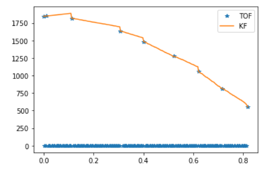

layout: page
title: "Lab 7"
permalink: /ECE4960_FastRobots/lab7/

# Lab 7 - Kalman Filter 
In this lab, I implemented a Kalman filter on the time of flight sensor readings. This is helpful for my robot's performancethe TOF sensor takes at least 52 ms to range and is not very reliable under variable lighting. 

## Step Response
I collected TOF readings toward the wall as I drove toward the wall. I used the step input of 255 PWM to my motors. I calculated speed and 90% rise time using this data. 


The calculated values are as follows:
steady state speed: 2.56 m/s
90% rise time = 0.642 s 

I implemented my dynamic and sensor model matrices in Python using numpy arrays and on the Artemis using the BasicLinearAlgebra library

```
const float D = 0.3904; // s/mm
const float M = 0.1088; // s^2/mm

const Matrix<2,2> A = {0, 1,
                       0, -D/M};
const Matrix<2,1> B = {0,
                       1/M};
const Matrix<1,2> C = {1, 0};
const Matrix<2,2> EYE2 = {1, 0,
                          0, 1};  
```

## Kalman Filter Setup
I began by using the preliminary covariances used in class. I then increased the sensor model covariance as my predictions, since I observed sensor readings that were a bit off from what I expected and did not want the filter to "trust" the sensor readings too much. In addition, I increased the uncertainty of the speed dynamic model, since the robot's speed depends on many complex factors (slip, whether it is facing square to the wall, battery charge) that compound with the uncertainty of the distance measurement. I implemented those constants into matrices that describe the sensor model

```
const float SIGMA_X = 27.7; // x-position uncertainty
const float SIGMA_SPEED = 75; // x-speed uncertainty
const float SIGMA_SENSOR = 50; // TOF sensor reading uncertainty

const Matrix<2,2> SIGMA_PROCESS = {pow(SIGMA_X,2), 0,
                                     0, pow(SIGMA_SPEED,2)}; // process noise
const Matrix<1> SIGMA_MEAS = {pow(SIGMA_SENSOR,2)}; // measurement noise
```

## Sanity Check - Python
I adhered to the provided sample code for my Kalman filter implementation, and added one additonal detail. I wrote a conditional case in the measurement-update step of my Kalman filter

``` 
if y > 0: 
        sigma_m = C.dot(sigma_p.dot(C.transpose())) + sigma_z
    else:
        sigma_m = np.array([[math.inf]]) # use infinite sensor noise if no sensor reading 
    
    kf_gain = sigma_p.dot(C.transpose().dot(np.linalg.inv(sigma_m)))
```

My TOF sensor reading data log records the cases where the sensor data is not yet ready using a negative value, where an invalid (typically out of range) reading is a 0. In my filter, I do not allow those cases to affect my Kalman filter update step by making the uncertainty in my measurement `sigma_m` infinite. Effectively, this makes my Kalman filter gain 0 and uses my belief from the prediction step as belief of the entire time step. 

By doing so, I am able to use my Kalman filter belief as a distance reading in the time steps where my TOF data is not ready. 

As a result, we can see that my Kalman filter beliefs follow my sensor measurements when there are no measurements.



## Kalman Filter on the Artemis
I implemented the Kalman Filter on the Artemis as a funtion tha is called by my `readDistToWall()` function. The function returns all of the entries in the belief and covariance matrices as individual for ease of data storage in arrays. 

```
tuple <float, float, float, float, float, float> kalmanFilter(float mu_x, float mu_dxdt, float sig11, float sig12, float sig21, float sig22, int u, int meas, float dt)
{
    // discretize state matrices, setup input matrices
    Matrix<2,2> time_step = {dt, 0,
                             0, dt}; // TODO: CAN WE DO CONSTANT MULTIPLICATION?
    
    Matrix<2,2> discreteA = EYE2 + time_step*A;
    Matrix<2,1> discreteB = time_step*B;

    Matrix<2,1> mu = {mu_x,
                      mu_dxdt};
    Matrix<2,2> sigma = {sig11, sig12,
                       sig21, sig22};
    Matrix<1> y = {meas};
 
    // prediction step
    Matrix<2,1> mu_p = discreteA * mu + discreteB * u/255;
    Matrix<2,2> sigma_p = discreteA * (sigma * ~discreteA) + SIGMA_PROCESS;

    Matrix<2,1> kf_gain = {0,
                           0};

    // only update with measurements if measurement is valid
    if(meas > 0)
    { 
        Matrix<1> sigma_m = C * SIGMA_PROCESS * ~C + SIGMA_MEAS;
        kf_gain = SIGMA_PROCESS * ~C * Invert(sigma_m);
        Matrix<1> y_m = y - (C * mu_p);
        mu = mu_p + kf_gain*y_m;
    }
    else
    {
        mu = mu_p;
    }
    
    sigma = (EYE2 - kf_gain * C) * SIGMA_PROCESS;
   
    return make_tuple(mu(0,0), mu(1,0), sigma(0,0), sigma(0,1), sigma(1,0), sigma(1,1));
}
```

Finally, we can see that using the Kalman Filter on the robot causes the robot to sense the wall (I set a threshold distance of 1600mm) when farther away from the wall.

Robot without Kalman filter
<a href="http://www.youtube.com/watch?feature=player_embedded&v=FjBTIxTd6u8" target="_blank"></a>

Robot with Kalman filter
<a href="http://www.youtube.com/watch?feature=player_embedded&v=V-jGclokk0Y" target="_blank"></a>