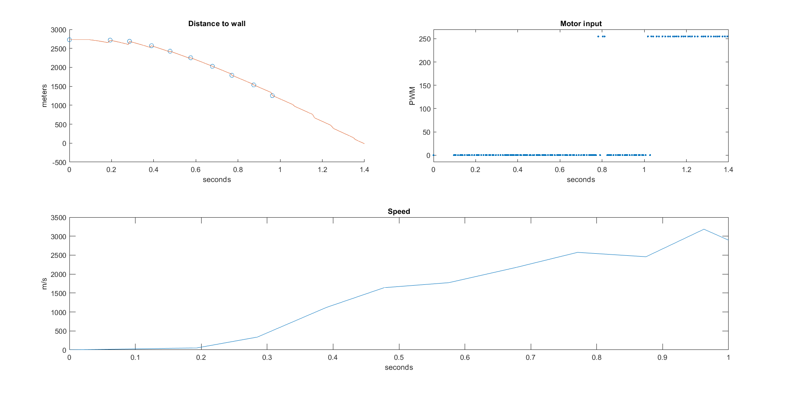

layout: page
title: "Lab 8"
permalink: /ECE4960_FastRobots/lab8/

# Lab 8 - Stunt
I chose to perform Task B, where my robot drives toward the wall at max speed then turn around once close enough to the wall. Here is a video demo

 

## Closed Loop Stunt w/ Kalman Filter
To accomplish this task, I used the Kalman filter from the previous lab. I found that my _d_ constant is too high. This happened becase my lab 7 lab prep may not have reached steady state and hence was based on too low of a steady state speed. Previously, _d = 390.3942 us/mm_. This is evident in the Kalman filter prediction decreasing slower than the actual TOF readings.

After some trial and error, _d = 280 us/mm_ worked much better. Another edit that I made was to input a slightly lower control speed than what the robot is actually using. This is because the logic of my code only uses full speed when the robot is driving straight. When the robot is correcting its path using PID angle control, it temporarily slows down. Hence I input 200 instead 255 (full speed) and got better results.

One challenge that I ran into included being able to get my robot to drive quickly after a setpoint change. As you can see in this blooper, my robot consistently does the waggle dance. I discovered that this problem was exacerbated as my battery level dropped. The two motors did not turn at the same rate when the current supplied was lower, which caused the robot to bias toward one way or the other and requiring the PID controller to take over and decrease the robot's speed. I was able to mitigate this issue by increasing the acceptable error and taking a dinner break while charging my battery. 

Another challenge that I encountered was the lighting in the Phillips hallway. The corner where the tape lines were setup is directly under one of the only lights that were on in that hallway. As a result, my robot would start in a darkened section of the hallway and point into a light section of the hallway. For some reason, this interfered greatly with the TOF sensors.The robot would register a wall when there is just a lighting inconsistency. This phenomenon occured as well when I tried starting the robot in a lit section of the hallway driving toward a dark section. As a result, I chose to move to the other end of the hallway where the lighting was even. 

## Open Loop Stunt - Batter Up
How fast is the fast robot? In this open loop stunt, we visualize the rotational kinetic energy of the robot transferred to the ASML foam robot. 

