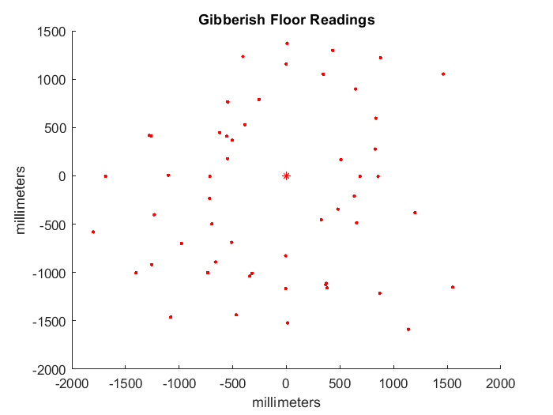
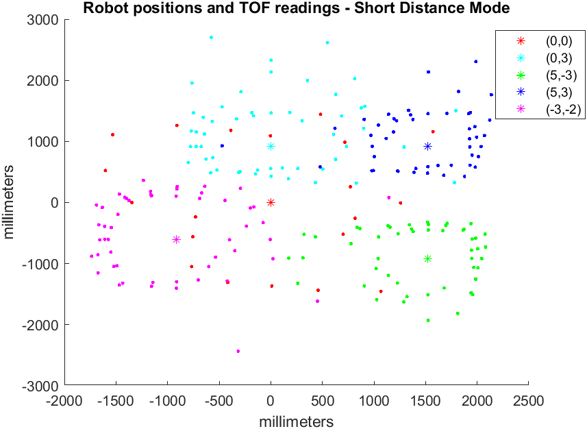
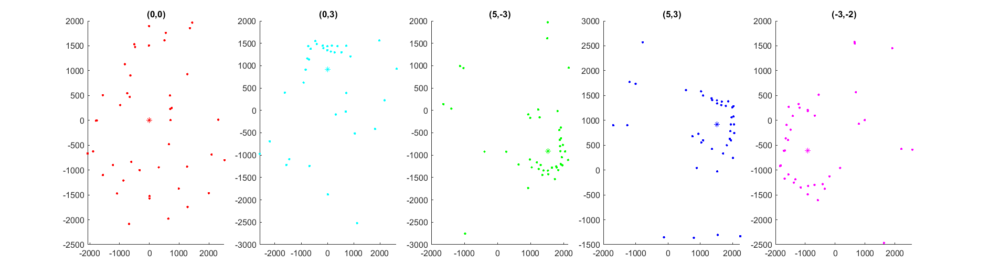
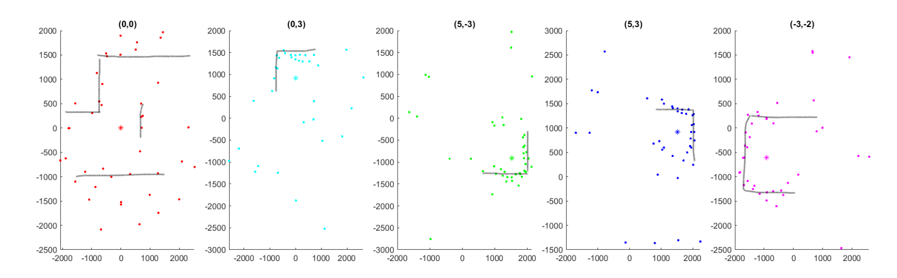
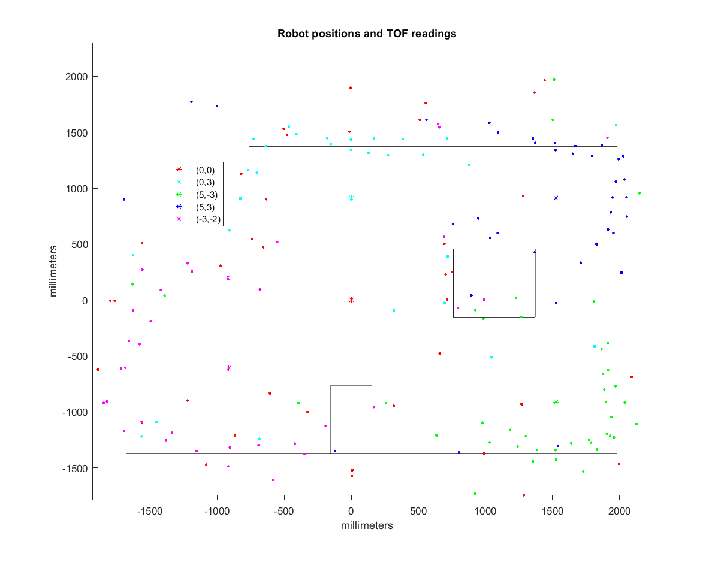

layout: page
title: "Lab 9"
permalink: /ECE4960_FastRobots/lab9/

# Lab 9 - Mapping
In this lab, I used the two time of flight sensors on my robot, positioned at (0, 70mm) and (35mm, 0), in the robot frame. Since I had already implemented orientation control from Lab 6, I decided to use orientation control for mapping. My mapping is initiated by sending a command to my robot that contained the number of readings per revolution that I wanted the robot to take. Then my robot calculates an `angleIncrement = 360/numData;`. For this lab, I chose to use 20 points for each revolution. This means that readings are taken at 18 decree increments. Each time the robot is "close enough" to the angular setpoint, it takes a read then increases the setpoint by `angleIncrement`. Since the TOF sensors are not instantly ready, I braked and waited for data to be ready every 18 degrees. 

```
void readTwoDistances()
{
    .
    . (brake so I can read while stationary)
    .
    
    tof1.startRanging();
    while(!tof1.checkForDataReady()){ delay(5);}
    
    distToWall[dataCount] = tof1.getDistance();
    tof1.clearInterrupt();
    
    tof2.startRanging();
    while(!tof2.checkForDataReady()){ delay(5);}
    
    distToWallSide[dataCount] = tof2.getDistance();
    tof2.clearInterrupt();
}
```

Another modification that I did was to tape my robot's wheels with duct tape. This decreased the deadband of my robot an helped the robot turn more smoothly. At first, my sensors were pointed a bit downwards and gave gibberish readings of the floor. 




After I fixed the sensor issue, I processed the raw data that I collected in the lab using MATLAB. Note: I did not using polar plotting in Python because I already had a helper function from AMR that converts robot frame coordinates to global coordinates. In hindsight adapting this function did not take that much less work and I should have just done data processing in Python.



As seen in the plots, the TOF sensors are decent at capturing the general shape of the surroundings. However, there are quite a few somewhat noisy readings for every plot. 



One of the reasons for the noisy, shifted readings is because the robot does not rotate perfectly on itself but this plot assumes that it does, the re-reading will be slightly affected. Since the robot travels about half a square after a full revolution, the readings will only get worse if I were to rotate more times around. The robot's angle control is also a source of error. My robot's angular control is within 0.5 degrees (as read by the gyroscope), so it may be okay to use pre-set angles. However, I chose to keep the angles read by the gyroscope since my robot rotates in the clockwise direction. The gyroscope also drifts as the robot turns. One way to account for this drift is to ask the robot to turn less and less as it turns by assuming some constant amount that the drift increases by with each turn. 

```
setPoint = setPoint + angleIncrement - numData*stepDrift
```

## Merging into a Map

As mentioned before, I used a function that I wrote in a different class to convert the readings from robot-frame coordinates: (0, y+70) for the front sensor and (x+35, 0) since the sensors are mounted 70mm to the front and 35mm to the right of the center of the robot for the side sensor. 

```
function[xyG] = robot2global(pose,xyR)
% ROBOT2GLOBAL: transform a 2D point in robot coordinates into global
% coordinates (assumes planar world).
% 
%   XYG = ROBOT2GLOBAL(POSE,XYR) returns the 2D point in global coordinates
%   corresponding to a 2D point in robot coordinates.
% 
%   INPUTS
%       pose    robot's current pose [x y theta]  (1-by-3)
%       xyR     2D point in robot coordinates (1-by-2)
% 
%   OUTPUTS
%       xyG     2D point in global coordinates (1-by-2)

    theta = pose(3);
    T_GR = [cos(theta), -sin(theta), pose(1);
           sin(theta), cos(theta), pose(2);
           0, 0, 1];
    n = (size(xyR));

    xyG = T_GR * [xyR, ones(n(1), 1)]';
    xyG(3, :) = [];    
    xyG = xyG';
end
```

The transformation matrix is described by `T_GR`, which is made of the rotation matrx as determined by the robot's orientation theta and the location of the robot. Left multiplying the transformation matrix by the coordinate of the reading in the robot's coordinates `xyR` and as described above gives the coordinate of the point seen by the TOF sensor in global coordinates.



Since the points that the TOF sensors read are quite close to the actual map, I simply augmented the map walls by counting squares. The biggest deviation from the map occur at the boxes. The robot captures the left face of the big box quite well, since it can see it from (0,0), (0,3), and (-3,-2). On the other hand, there are virtually no points on the righthand side of the box. The smaller box was mixxed even more, as it is narraow and easily missed by the points (0,0), (0,3). Moving during mapping, gyroscope drift, noisy TOF sensor, and shifted wooden planks are all reasons why the points on the map can be off.