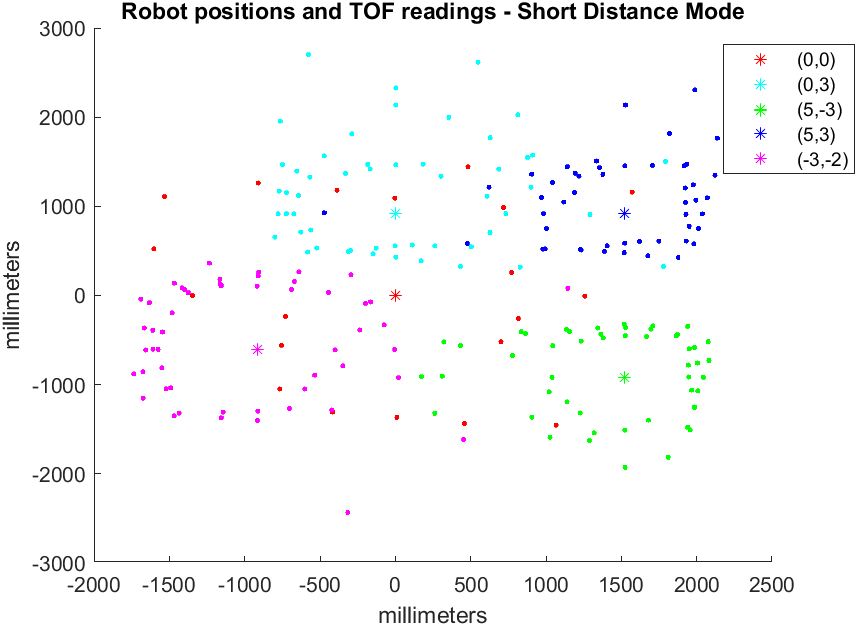

layout: page
title: "Lab 9"
permalink: /ECE4960_FastRobots/lab9/

# Lab 9 - Mapping
In this lab, I used the two time of flight sensors on my robot, positioned at (0, 70mm) and (35mm, 0), in the robot frame. Since I had already implemented orientation control from Lab 6, I decided to use orientation control for mapping. At first, I accidentally used short distance mode on my sensor to map the environment. It yielded some results that didn't make much sense



I returned to the lab to collect data again


I processed the raw data that I collected in the lab using MATLAB. I re-used a function that I wrote in AMR. The function performs a matrix transformation between from robot frame coordinates to global coordinates.

```
function[xyG] = robot2global(pose,xyR)
% ROBOT2GLOBAL: transform a 2D point in robot coordinates into global
% coordinates (assumes planar world).
% 
%   XYG = ROBOT2GLOBAL(POSE,XYR) returns the 2D point in global coordinates
%   corresponding to a 2D point in robot coordinates.
% 
%   INPUTS
%       pose    robot's current pose [x y theta]  (1-by-3)
%       xyR     2D point in robot coordinates (1-by-2)
% 
%   OUTPUTS
%       xyG     2D point in global coordinates (1-by-2)

    theta = pose(3);
    T_GR = [cos(theta), -sin(theta), pose(1);
           sin(theta), cos(theta), pose(2);
           0, 0, 1];
    n = (size(xyR));

    xyG = T_GR * [xyR, ones(n(1), 1)]';
    xyG(3, :) = [];    
    xyG = xyG';
end
```
